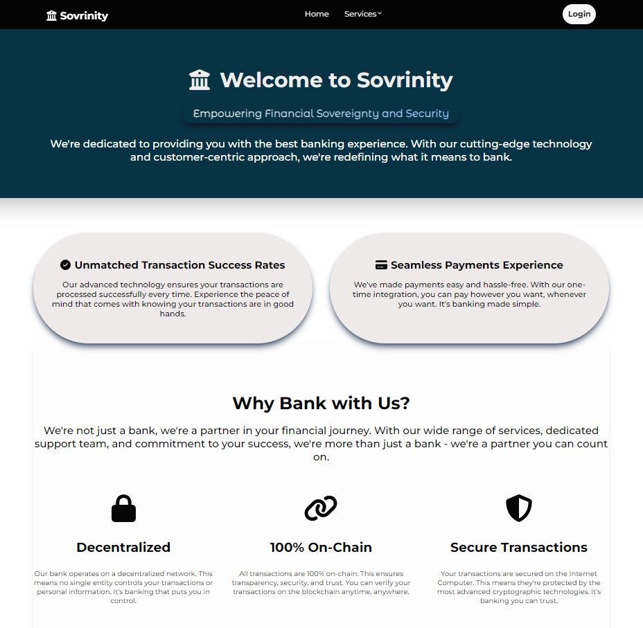

# Sovrinity

## Overview

<<<<<<< HEAD
<<<<<<< HEAD
Are you a user worried about your privacy on the blockchain? Or are you simply looking for a convenient way to manage your finances. Look no further. Sovrinity (Sovereign and Security), is a fully and truly decentralized application that allows users to secure their financial transactions while also using Zero-Knowledge Proofs. Everything is hosted on the blockchain.


=======
Are you a user worried about your privacy on the blockchain? Or are you simply looking for a convenient way to manage your finances. Look no further. Sovrinity (Sovereign and Security), is the first fully and truly decentralized application that allows users to secure their financial transactions while also using Zero-Knowledge Proofs. Everything is hosted on the blockchain.
>>>>>>> 71c3497 (Sovrinity_bank)
=======
Are you a user worried about your privacy on the blockchain? Or are you simply looking for a convenient way to manage your finances. Look no further. Sovrinity (Sovereign and Security), is a fully and truly decentralized application that allows users to secure their financial transactions while also using Zero-Knowledge Proofs. Everything is hosted on the blockchain.


>>>>>>> 00da59d (Sovrinity_bank)

## Main Features

- Transfer Funds
- Deposit
- Withdraw
- Dashboard

## Getting Started

### Prerequisites

Follow these instructions from the Internet Computer website [to install dfx and the CDK](https://internetcomputer.org/docs/current/developer-docs/getting-started/install/). You can skip this step if you have already installed the required tools.
After you have installed the required tools, you can move on to the next step.

### Installation

1. **Clone the repository:**
<<<<<<< HEAD

    ```bash
   git clone https://github.com/Nimakra/Sovrinity_bank.git
=======
>>>>>>> 71c3497 (Sovrinity_bank)

    ```bash
   git clone https://github.com/Nimakra/Sovrinity_bank.git

2. **Install dependencies:**

   ```bash
   npm install

3. **Start the local replica:**

   ```bash
   dfx start --clean --background

4. **Deploy the canister locally:**

   ```bash
   dfx deploy

## Tech Stack

- React Typescript
- Tailwind CSS
- mops

## Limitations, Recommendations and Future Works

- More features are in progress

## Let's Build Together
